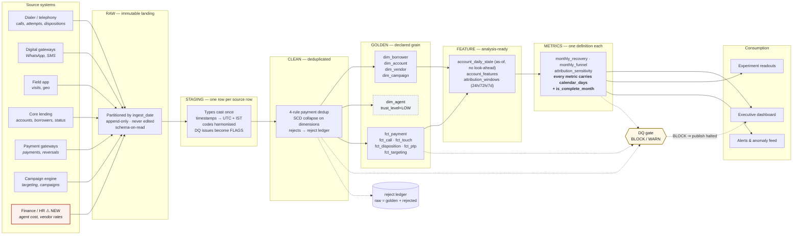

# Production Analytics Architecture

How this analysis becomes a system leadership can open every morning without being lied to.

The design goal is not "a pipeline". It is **making the specific failures found in this dataset
structurally impossible to repeat**: a partial month cannot enter a MoM series, a naive timestamp
cannot reach a report, a legacy disposition code cannot silently halve a metric, and an
un-instrumented cost cannot masquerade as a computed one.

---

## Flow



⚠ **The finance/HR feed does not exist today.** Without it, cost per ₹ recovered — a headline
metric in the current reporting — is not computable. It is drawn here because building the rest
without it produces a dashboard that still cannot answer the question that matters.

---

## Layer contracts

| Layer | Grain | Mutability | May contain | Must never contain |
|---|---|---|---|---|
| **Raw** | source row | append-only, never edited | anything the source sends | any transformation |
| **Staging** | source row | rebuilt from raw | casts, IST conversion, code harmonisation, DQ flags | filters, joins, dedup |
| **Clean** | source row minus duplicates | rebuilt from staging | dedup, SCD collapse | business logic, aggregation |
| **Golden** | **declared and tested** | rebuilt from clean | conformed dims and facts | metric logic |
| **Feature** | account / account-day | rebuilt from golden | as-of joins, windows, derived attributes | anything using future information |
| **Metrics** | month / day / segment | rebuilt from feature | one definition per metric, all normalised | ad-hoc BI-tool arithmetic |

**The rule that matters:** *quality issues become flags in staging, never filters.* An analyst who
needs to exclude something does so explicitly and visibly downstream. A filter buried at ingest is
how a denominator quietly changes and a rate quietly improves.

---

## Data contracts

Each source publishes a contract the pipeline enforces on arrival. A breach fails the load and
pages the owning team — it does not degrade silently.

```yaml
source: payment_gateway.payments
owner: payments-platform
sla: { freshness: 2h, completeness: 99.5% }
schema:
  payment_id:        { type: string,    required: true, unique: true }
  account_id:        { type: string,    required: true, fk: accounts.account_id }
  payment_reference: { type: string,    required: false, unique: false }   # NOT unique — see note
  amount:            { type: decimal,   required: true, min: 0 }
  payment_status:    { type: enum,      required: true, values: [SUCCESS, FAILED, PENDING, REVERSED] }
  event_at:          { type: timestamp, required: true, tz: "UTC", offset_column: null }
semantics:
  payment_reference: >
    Gateway reference. NOT globally unique — observed reused across different accounts
    and amounts. Never use alone as a deduplication key.
on_breach:
  new_enum_value: BLOCK    # a new payment_status silently changes what "recovery" means
  schema_drift:   BLOCK
  freshness_miss: WARN
```

Three contract clauses exist purely because of what this dataset did:

1. `payment_status` enum is **BLOCK** on a new value — a fifth status would silently redefine
   recovery.
2. `payment_reference` is explicitly documented as **not unique**, so nobody deduplicates on it.
3. Every timestamp declares `tz` and `offset_column`. A naive local timestamp with the zone in a
   separate column is a contract violation, not a quirk to work around downstream.

---

## Primary keys and grain

| Table | Key | How it is enforced |
|---|---|---|
| `dim_borrower` | `borrower_id` | SCD-1 collapse ranked on `GREATEST(created_at, updated_at)` |
| `dim_account` | `account_id` | natural, 100% clean in source |
| `dim_agent` | `agent_id` | SCD-1, **quarantined** — join-safety only |
| `fct_payment` | `payment_id` | 4-rule dedup ladder |
| `fct_call` | `call_id` | dedup after IST conversion |
| `fct_targeting` | `target_id` | dedup + as-of status join |
| `metrics.monthly_*` | `month` | month spine, so an empty month is zero, not missing |

Uniqueness is a **BLOCK-severity assertion** on every one of these, not a comment.

---

## Metric definitions

Each metric has exactly one definition, stored with the code and rendered in the dashboard
tooltip. Where the current reporting differs, both are shown so the change is auditable.

| Metric | Definition | What it replaces |
|---|---|---|
| Net recovery | `SUCCESS − REVERSED`, transaction-deduped | gross SUCCESS with duplicates (+9.9%) |
| Recovery per day | net recovery ÷ calendar days in month | monthly total (the 11% artifact) |
| Contact rate | answered calls ÷ calls placed, IST clock | mixed denominators, raw timestamps |
| RPC rate | RPC dispositions ÷ all dispositions | dispositions ÷ calls (streams are not nested) |
| PTP rate | `disposition_std = PROMISE_TO_PAY` ÷ dispositions | `code = 'PTP'` (undercounts 50%) |
| PTP kept rate | kept ÷ **resolved** promises | kept ÷ all promises (manufactured downtrend) |
| Channel conversion | **not published** | last-touch (an artifact of window choice) |
| Cost per ₹ recovered | **blocked until the cost feed exists** | currently not computable |

Two of these are deliberately *absent*. Publishing a number that cannot be computed is worse than
publishing nothing, because it gets used.

---

## Lineage

Every metric traces to source columns via the dbt-style DAG. Practically:

- **Column-level lineage** captured from the transformation graph, so "which sources feed net
  recovery" is a query, not an archaeology project.
- **Every golden row carries** `_ingest_batch_id`, `_source_file`, `_transformed_at`.
- **The reject ledger closes the loop**: `raw = golden + rejected`, reconciled on every run. If it
  does not reconcile, the run fails.
- **Dashboard tiles link to their definition and lineage.** The fastest way to stop a bad metric
  is to make its provenance one click away from the person quoting it.

---

## Incremental processing

Event tables are large and append-mostly; dimensions are small and mutate.

- **Facts** — incremental `MERGE` on the surrogate key, partitioned by `event_date` (IST).
  Each run reprocesses a **rolling 7-day window**, not just yesterday, because dispositions and
  status rows arrive out of order.
- **Dimensions** — full rebuild. They are small and SCD logic on a partial set is where subtle
  identity bugs live.
- **Metrics** — recomputed for any month touched by the incremental window; never patched in place.

```sql
MERGE INTO golden.fct_payment tgt
USING (SELECT * FROM clean.payments
        WHERE event_date >= CURRENT_DATE - INTERVAL 7 DAY) src
   ON tgt.payment_id = src.payment_id
 WHEN MATCHED AND tgt._row_hash <> src._row_hash THEN UPDATE SET *
 WHEN NOT MATCHED THEN INSERT *;
```

---

## Late-arriving data

Observed ingestion lag in this dataset is symmetric about zero (p5 −21.6h, p50 −0.1h, p95 +21.6h)
— clock skew, not a delivery queue. Both directions must be handled.

| Case | Treatment |
|---|---|
| Event arrives late | 7-day reprocessing window catches it; the affected day is restated |
| Event arrives with a future `event_at` | **BLOCK** — clock skew at source, not a valid business fact |
| Dimension change arrives late | full dimension rebuild each run |
| Payment arrives after month close | day restated for 7 days, then the month is **frozen** |

**Restatement is visible.** A daily figure carries a `restated` flag for 48 hours, and the
dashboard shows a subtle marker rather than silently changing a number somebody screenshotted.

---

## Backfills

- Backfills run through the **same code path** as incremental — a separate backfill script is how
  the two diverge and history stops matching the present.
- Parameterised by date range, executed into a **shadow schema** first.
- **Diff gate:** the shadow output is compared against production before the swap. Any metric
  moving more than 1% without an explained cause fails the backfill.
- The swap is atomic (partition exchange / table rename).
- Every backfill is logged with its reason, range and diff summary. When a number changes,
  somebody can find out why.

---

## Data-quality checks

Implemented in `sql/03_data_quality_checks.sql`. **BLOCK** halts publication; **WARN** publishes
with a banner. Each check returns zero rows when healthy.

| Severity | Check | The failure it prevents |
|---|---|---|
| BLOCK | PK uniqueness on every dim and fact | re-ingest, surrogate reuse |
| BLOCK | Referential integrity on money | orphaned payments |
| BLOCK | Enum domains (`payment_status`, `disposition_std`, `timezone`) | a silent redefinition of a metric |
| BLOCK | No future-dated events | clock skew |
| BLOCK | **No MoM on a partial month** | **the August problem** |
| BLOCK | Metrics reconcile to facts | broken transformation |
| WARN | **Headline MoM vs per-day MoM diverge > 5pp** | **the February problem** |
| WARN | Daily volume outside 4σ | ingest failure or spike |
| WARN | Rejection rate > 25% | over-aggressive cleaning |
| WARN | Orphan borrower links > baseline | source drift |

The two bolded checks would have stopped the 11% claim before it reached a slide. They cost about
twenty lines of SQL.

---

## Monitoring and anomaly detection

**Three layers, each answering a different question.**

1. **Freshness and volume** — is data arriving? Per-source row counts and max `event_at` against
   the contract SLA. Alerts on absence, which is the failure mode dashboards hide best.

2. **Distributional drift** — is data arriving *the same*? Population Stability Index on
   `payment_status`, `disposition_std`, `risk_segment`, `vendor_group`, `timezone`. PSI > 0.25
   pages the data team. This is what catches a vendor mapping change or a taxonomy migration
   *while it is happening*, rather than six months later in a forensic review.

3. **Metric anomaly detection** — is the *number* plausible? Per-day metrics against a
   trailing 28-day median with a robust (MAD-based) band. Deliberately per-day, so calendar
   length can never trigger an alert.

**Guardrail metrics run alongside the performance metrics, on the same screen:**
complaints per 1,000 contacts by channel, and share of contacts outside the 08:00–21:00 IST
window. Both currently sit outside acceptable bounds and neither appears in any existing report.
A collections dashboard that shows recovery without showing complaint rate and calling-window
compliance is only telling you half of what the operation is doing.

---

## Experiment infrastructure

Because the honest answer to "where should the ₹10 Cr go" is *run the test first*, the platform
treats experimentation as a first-class output rather than an analyst's side project:

- **Assignment service** — deterministic hash-based bucketing, stratified on
  `risk_segment × dpd_band × outstanding decile`, with the assignment stored as a fact.
- **Pre-registration** — hypothesis, primary metric, sample size and stopping rule committed to
  the repo before launch. A readout that does not match a pre-registration is not published.
- **Standard readout** — intention-to-treat difference in means, CUPED-adjusted on pre-period
  recovery, with the confidence interval and the minimum detectable effect always shown next to
  the point estimate.

That last clause is the whole lesson of this exercise. **A point estimate without its confidence
interval is how "+11%" happens.**
